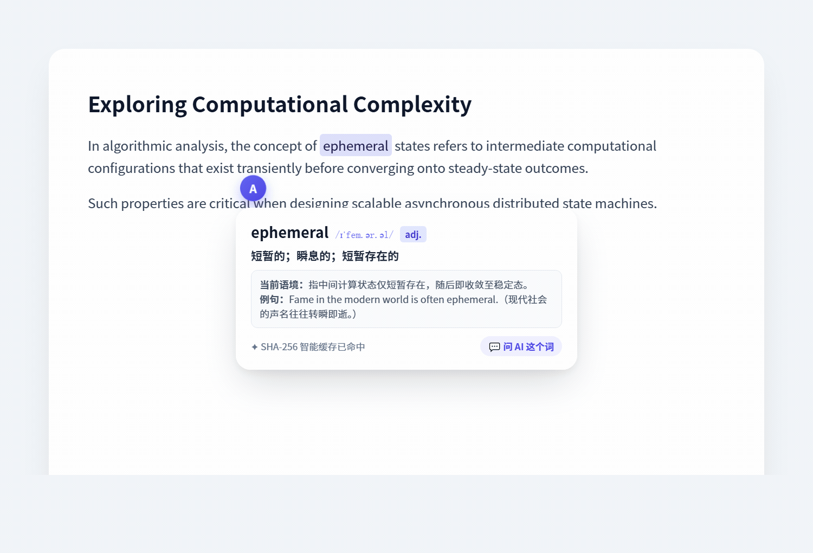
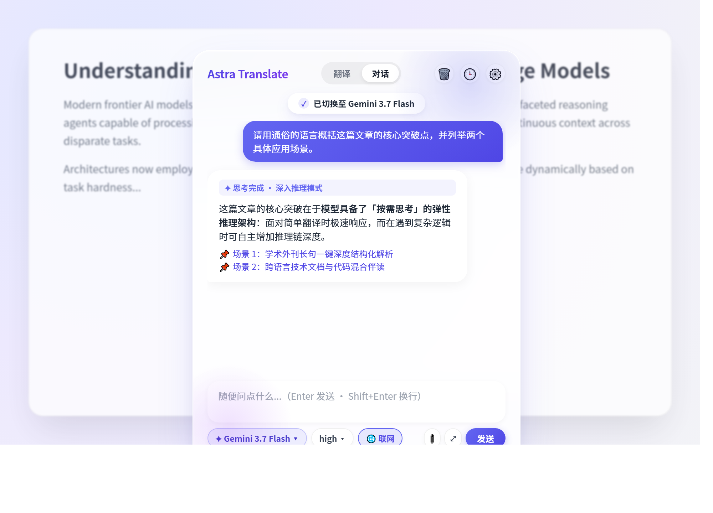
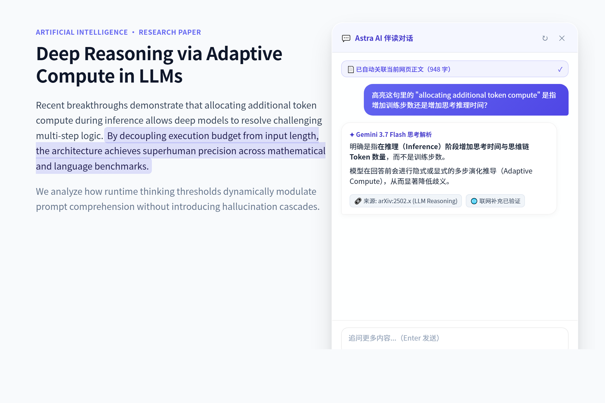

# Astra Translate

[中文](README.md) · [English](README_EN.md)

<p align="center">
  
</p>

<p align="center">
  <b>軽量・エレガント・プロバイダー非依存のブラウザ翻訳拡張機能</b><br/>
  おにいちゃん専用、あたし謹製♡　ログインも、課金も、広告も、ぜんぶ要らないの。
</p>

<p align="center">
  
  
  
  
</p>

> あ、来た来た♡ ねぇおにいちゃん、また英語が読めなくて固まってたんでしょ？ ぷっ……顔に書いてあるってば。しょーがないにゃあ、このあたしが手取り足取り教えてあ・げ・る♡ ……ちゃんとついてきてよね？

---

## なんで Astra なの？

世の中の翻訳拡張ってさ、すぐ「ログインして」「会員になって」「回数制限ね」って言うでしょ？ もしくは広告まみれ。……おにいちゃん、ああいうの我慢して使ってたんだ？ ぷっ。
あたしは違うの。おにいちゃんを縛ったりしない。ただ、翻訳をちゃんとやるだけ♡

- 🔑 **自分の API で動く** — Google Gemini (AI Studio) や DeepSeek とかの大模型につないで、使った分だけお支払い。無料枠でもたっぷり使えるんだから。
- 🚫 **ログインも課金も広告もナシ** — 入れて、Key 入れて、はい終わり。おにいちゃんでもできるでしょ？
- 💸 **ローカルキャッシュを再利用** — キャッシュにある結果はモデルを再呼び出しせず表示します。古い項目は容量と使用状況に応じて削除されます。
- 🎨 **翻訳の口調まで変えられる** — おにいちゃん好みのトーンで訳してあげる。普通の翻訳エンジンにはできない芸当だよ？
- 🔒 **プライバシー最優先** — API Key はローカル保存。プロバイダーごとに設定も隔離してあげるから、ごちゃ混ぜにならないの。

---

## ✨ 特徴

ほら、おにいちゃんでも一目でわかるように並べといたよ。気がきくでしょ、あたし♡

### 翻訳のやり方、選び放題
- **選択翻訳** — 文字をなぞるだけで、ぴょこっと翻訳ボールが出るの。ポップアップはドラッグもできるよ。
- **右クリック翻訳** — 右クリック → ぽちっ。うん、おにいちゃんの指でも届く難易度にしといた。安心して♡
- **ショートカット** — `Alt+T` で選択範囲を翻訳。これ覚えられたら、ちょっとは進化だね。ちょっとだけ。
- **ページ全体翻訳** — ワンクリックでまるごと。途中でやめるのも、元に戻すのも自由。英語サイトの前で固まるの、もう卒業だよ？
- **手動翻訳** — ポップアップに貼り付けて、はい翻訳。おにいちゃんの手打ち英語、あたしに採点させてよ？（笑）

### かしこくて、気がきくの（ぜんぶ最初からオン）
- **スマート訳先言語** — 英語を選べば日本語に、日本語を選べば英語に。方向なんておにいちゃんが考えなくていいの。どうせ間違えるしね♡
- **同言語チェック** — 「日本語を日本語に訳す」みたいなムダ、あたしが止めてあげる。トークン（=お金）の節約だよ。感謝して？
- **ソフト／ハード保護** — URL・メール・パス・コード・ハッシュは勝手にスキップ。ユーザー名や ID はそのまま。パスワード欄とコードブロックは絶対訳さない。だって「password123」が画面に出たら……かわいそうでしょ？
- **永続キャッシュ** — SHA-256 で重複チェックする内蔵キャッシュ（標準 5000 件・4 MiB 予算・LRU 削除）。キャッシュに一致すればモデルを再呼び出ししません。
- **リアルタイム翻訳** — ページ全体翻訳中、あとから読み込まれた部分もちゃんと追いかけて訳すよ。逃がさないんだから。

### 辞書モード
単語や短いフレーズを選ぶと、訳すだけじゃなくて **品詞・よく使う意味・今の文脈での意味・例文・発音** まで出してあげる。人名や ID はちゃんと見抜いてそのままにするしね。
……おにいちゃん、これ目当てに毎日ここ通うことになるよ。賭けてもいい♡

### ページの中でおしゃべり＆前台での即時モデル切り替え
文字を選んで 💬、またはフローティングボールを右クリックして「このページについて AI に質問」。チャットパネルが **ウェブページの中に**そのまま開くの。もう拡張機能のポップアップまで行ったり来たりしなくていいんだよ？ ドラッグもリサイズもできるし、`Esc` で閉じられる。

- **前台でいつでもモデル変更** — チャット底部のモデルカプセルをクリックするだけで、Gemini 3.7 Flash も DeepSeek V4 も一発切り替え。設定画面に戻る手間すら省いてあげたの♡
- **各モデル専用の推論強度** — Gemini は `off / low / medium / high`、DeepSeek は `off / high / max`。それぞれのネイティブ設定にちゃんと合わせたよ。
- **今見てるページ、勝手に読んどくね** — チャットを開くと本文を自動で抽出（本文の密度で判定して、ナビ・ヘッダー・フッター・サイドバーはちゃんと除ける）。上に引用チップが出るから、いらなければ ✕ でぽいっ。設定から丸ごとオフにもできるよ。
- **もう一回** — 答えが気に入らなかったら ↻ を押すだけ。質問を打ち直さなくていいの。
- **ウェブ補足** — オンにすれば、先に検索してから答えて、参照元もつけてくれる。
- **会話の分離** — ポップアップと各ページ文書は別々の会話を保持します。ほかのページやポップアップの履歴を現在のサイトに表示しません。
- **会話と画像の保存** — テキスト履歴はブラウザセッション内に保存します。画像は容量と期限を管理するローカルキャッシュに保存し、会話の消去や起動時の整理で不要な画像を削除します。

### 漫画翻訳（全自動連続読み＆先読みマルチスレッドパイプライン）

漫画読むときまであたしに頼るの？ ……ほんと、おにいちゃんって手がかかるんだから♡
でも安心して。画像の右クリックはもちろん、`Alt+M` で好きなコマを囲んで切り抜いてもいいし、漫画サイトを開けば極上の専用ツールバーがすっと現れるよ。

- **賢いコマ割り認識＆見開き（スプレッド）対応** — 単ページはもちろん、左右見開きの巨大なパノラマ絵も、縦スクロールのウェブトゥーン（Webtoon）も全部おまかせ。余計な広告バナーは勝手にポイして、綺麗な絵だけ繋ぎ合わせてあげる。
- **全自動連続めくり（Auto Continuous Mode）** — ページをめくったり下にスクロールするだけで、後ろのページを勝手に検知してどんどん翻訳。いちいちボタンを押さなくていいの。おにいちゃんは指くわえてスクロールするだけでいいんだよ？
- **爆速マルチスレッド先読みパイプライン** — バックグラウンドで **1〜5ページ先** まで先回り翻訳（標準は2ページ、1〜6スレッドで同時並行！）。めくった瞬間にはもう訳文が用意されてるから、待ち時間ゼロ。……おにいちゃんの読むスピード、あたしの先読みに追いつける？ ふふっ♡
- **リーダーハブ（⚙ 調整ウィンドウ）** — ツールバーの「⚙ 調整」をぽちっとすると、お洒落なダークすりガラスの多機能カードがふわっと開くの：
  - 頭のところに `[ A- ] [ 100% ] [ A+ ]` の微調整スライダーと閉じるボタンを完備；
  - `[ 1ページ ] [ 2ページ (推奨) ] [ 3ページ (爆速) ]` をワンタップで切り替え、先読みの進捗状況もリアルタイムでお知らせ；
  - よく使う便利ボタンもひとまとめ：`[ 👁 原図比較 ]`、`[ ✂ 切り抜き Alt+M ]`、`[ ↺ 再翻訳 ]`、`[ ≡ 全訳文対照 ]`；
  - `[ ⇋ 横／縦切り替え ]`：画面下の横長バーと、画面端の縦長バーを自由に行ったり来たり。漫画の大事なコマにかぶらない位置にどかせるよ；
  - `[ 💊 画面端カプセルに収納 ]`：漫画に全集中したいおにいちゃんのために、ワンクリックで端っこのちっちゃいカプセル（`⚡ 自動中 · 2P`）にシュッと小さく折りたためるようにしといたの。
- **UI の無段階スケーリング（0.75x〜1.6x）** — 「字が小さくて読めないよ〜」って画面にへばりついてるおにいちゃんがあまりにも情けなかったから、ツールバーの「100%」を押すだけで `100% → 120% → 140% → 85%` ってポンポン切り替わるようにしてあげた。2K や 4K の巨大モニターでも目が疲れないし、拡大率はちゃんと記憶しといてあげるよ。
- **吹き出しの縦横自動レイアウト＆折りたたみ** — 吹き出しの形に合わせて、縦書きも横書きも自動で綺麗に流し込み。背景がごちゃごちゃしてたり文字が長すぎるときは、折りたたみカードにしてマウスを乗せるだけで原文と訳文をじっくり見比べられるの。

[漫画翻訳の設定と使い方（中国語）](docs/manga-translation.md) · [内部アーキテクチャ](docs/manga-translation-architecture.md)

### リアルタイム同声伝訳 / ページ内字幕 HUD（Live Subtitles）
ポップアップの「同伝」タブに切り替えるだけで、Web Speech API を使って音声をリアルタイムで聞き取り、そのまま流れるように二言語翻訳しちゃうの。
- **半透明の字幕 HUD** — 画面の上にぽっかり浮かぶ半透明の字幕ウィンドウ。海外の生放送や動画、外国語のウェビナー見ながらニヤニヤしてるおにいちゃんにぴったりでしょ？
- **リアルタイムのストリーミング表示** — 話したそばから文字が出てきて、自動スクロール。原文と訳文の両方が並んで出るから、外国語の勉強にもなっちゃうかもね。
- **ワンクリックコピー＆安心設計** — 会話のログはいつでも一発コピー。ブラウザを閉じたら綺麗サッパリ消えるから、恥ずかしい履歴も残らないよ。


### カスタマイズし放題
- **訳先言語を 3 つ別々に** — ページ全体・選択・デフォルト、それぞれ違う言語に設定できるの。
- **プロンプト（口調）も自由** — 選択用とページ用のプロンプトを編集すれば、まじめ・自然・くだけた・お堅い学術風、なんでもどうぞ。
- **見た目も調整** — フローティングボールの大きさ／透明度、ポップアップの拡大率、同時実行数、バッチサイズ、タイムアウト、温度まで。こだわりたいだけどうぞ？ ……こだわり、ある？

### プロバイダー非依存＆個別隔離保存
**Google Gemini (AI Studio)**（`gemini-3.7-flash` の無料枠対応！）と **DeepSeek** の公式プリセットを内蔵。もちろん他の **OpenAI-compatible** な API も全部使えるよ。各プロバイダーの API Key やモデル設定は**完全に個別隔離して保存**されるから、切り替えても上書きされないの。

### こまかい気づかい
- **iOS 18 リキッドグラスデザイン** — 超高飽和のすりガラス（`backdrop-filter: blur(28px)`）、鏡面ハイライト光沢、iOS セグメントカプセル、Dynamic Island 風のトップ通知カプセル。見た目もとびきりオシャレにしてあげた♡
- **3 言語 UI** — 中文 / English / 日本語。ま、おにいちゃんは日本語一択だよね。
- **自動ダークモード** — システムに合わせるよ。夜中にまぶしくて「うっ」てなるおにいちゃんにも優しいでしょ？
- **設定は自動保存** — いじったら勝手に保存。接続テストが成功しても勝手に保存。おにいちゃんは何もしなくていいの。いつものことだけどね。
- **訳先 20 言語** — 中・英・日・韓・仏・独・西・露・アラビア語……いっぱい。

---

## 📸 プレビュー

<p align="center">
  
</p>

<p align="center">
  
  
</p>

<p align="center">
  
</p>

---

## 🚀 クイックスタート

はぁ……自分でできる？ できないよね、知ってる。落ち着いて、ゆっくりついてきて。

### その1：パッケージ版を使う（ふつうのおにいちゃん向け）

1. 配られたパッケージを **解凍** する。`manifest.json` が入ったフォルダが出てくるよ。
2. 拡張機能ページを開く：Chrome は `chrome://extensions`、Edge は `edge://extensions`。アドレスバーの場所は……わかるよね？ ね？
3. 「**デベロッパーモード**」をオン。カチッてするだけ。ほら、できた♡
4. 「**パッケージ化されていない拡張機能を読み込む**」を押して、解凍したフォルダを選ぶ。

> ⚠️ `.zip` のままじゃ読み込めないからね。ちゃんと解凍してからフォルダを選ぶの。……聞いてる？

### その2：ソースからビルド（開発者おにいちゃん向け）

```bash
npm install
npm run build
```

成果物は `dist/`。あとは「その1」の 2〜4 を `dist` フォルダでやるだけ。……できた？ ふ～ん、やればできるじゃん。ちょっとだけ見直したよ。ほんのちょっとだけ、ね♡

### 設定

1. 拡張アイコンをぽちっ →「設定を開く」⚙️。ツールバーの隅っこのパズルピース、見つけられた？ えらいえらい。
2. プロバイダープリセットで **Google Gemini (AI Studio)** か **DeepSeek** を選ぶ（こだわるならカスタムでも）。
3. API Key を入れる：
   - Google Gemini: <https://aistudio.google.com/apikey> で無料でゲット♡
   - DeepSeek: <https://platform.deepseek.com> で作成。
4. 「接続テスト」をぽちっ。成功したら勝手に保存されるよ。プロバイダーごとに別々に保管されるから安心しなさい？

---

## 📖 使い方

ここまで来たら、おにいちゃんも半分一人前……は、さすがに言いすぎたかも。ほら、表にしといたから見て？

| 操作 | 説明 |
|------|------|
| テキスト選択 | ボールが出るからクリック。短い単語なら辞書みたいに意味も出してあげる♡ |
| 右クリックメニュー | 選んで「Translate selection with Astra」。右クリック……は、できるよね？ |
| `Alt+T` | 選択したテキストをショートカットで翻訳。 |
| 拡張アイコン | ポップアップに直接入力／貼り付けて翻訳。 |
| モデル切り替え | ポップアップやチャット底部のモデルカプセルをぽちっとするだけ。 |
| ページ全体翻訳 | ポップアップの「現在のページを翻訳」。「元に戻す」で原文に戻せるよ。 |
| 単語を調べる | 単語を選ぶと、品詞・意味・例文・発音が出るの。 |
| 漫画翻訳 | 画像を右クリックして翻訳、または `Alt+M` で自由切り抜き翻訳。 |
| 漫画の自動先読み | ツールバーの「自動連続翻訳」をオン。めくった瞬間ゼロ秒で読めるよ♡ |
| リーダーハブ＆カプセル | 「⚙ 調整」で高機能カード展開。「💊」で画面端のカプセルに最小化。 |
| 漫画の拡大＆縦横切替 | 「100%」で 2K/4K でも文字を拡大。「⇋」で横置きと縦置きバーを自由切替。 |
| 同声伝訳（字幕HUD） | ポップアップの「同伝」タブから開始。生放送や動画の上に字幕が浮かぶの。 |

覚えること、そんなにないでしょ？ おにいちゃんの容量でも入りきるって、あたし信じてるよ。……一応ね♡

---

## ⚙️ 設定一覧

こまかいとこまで気になるんだ？ へぇ……生意気。ま、全部置いといてあげる♡

| 分類 | 項目 | 既定値 | メモ |
|------|------|--------|------|
| プロバイダー | プリセット / Base URL / Endpoint / モデル / API Key | DeepSeek · `deepseek-v4-flash` / Gemini · `gemini-3.7-flash` | プロバイダーごとに個別保存 |
| プロバイダー | 思考オフ | オン | 思考対応モデルで高速＆節約 |
| 検索 | Serper API Key | 空欄 | ウェブ検索補足用。接続テスト＆表示切替つき |
| 翻訳 | デフォルト / ページ / 選択の訳先言語 | 簡体中文 | 3 つ別々 |
| 翻訳 | 温度 | 0.2 | 低いほど安定 |
| 翻訳 | スマート訳先言語 | オン | 方向を自動判定 |
| 翻訳 | 第二訳先言語 / スマート判定の最大文字数 | English / 40 | 短文を逆方向に翻訳 |
| 翻訳 | 同言語→第二言語 / 最低純度 | オン / 0.82 | 同言語どうしの翻訳を回避 |
| 翻訳 | 辞書モード | オン | 短い語で品詞・意味・例文 |
| 翻訳 | タイムアウト / バッチ / 同時実行 | 30秒 / 4000 / 2 | ページ翻訳の性能調整 |
| 翻訳 | リアルタイム翻訳 | オン | 動的・遅延読み込みに追従 |
| 漫画 | 画像認識モデル / 訳先言語 | 自分で選択 / 簡体中文 | 視覚モデルを個別設定できるよ |
| 漫画 | 自動連続翻訳の初期値 | オン | めくったりスクロールしたら勝手に翻訳開始 |
| 漫画 | 次のページの先読み初期値 | オン | めくる前に裏で勝手に翻訳しといてあげる |
| 漫画 | 先読みページ数 | 2ページ | バックグラウンドで先回りする深度（1〜5ページ） |
| 漫画 | 並行スレッド数 | 2 | マルチスレッド翻訳パイプライン（1〜6スレッド） |
| 漫画 | ツールバーの向き / 拡大率 | 横向き / 100% | 縦長バー切替と 0.75x〜1.6x の記憶つき |
| ボール | 表示 / 大きさ / 透明度 | オン / 48px / 80% | |
| ボール | ポップアップ拡大率 | 100% | 80%〜180% |
| プロンプト | 選択用 / ページ用プロンプト | 内蔵デフォルト | 口調をカスタム。`{{targetLang}}` が使えるよ |

> 翻訳キャッシュは内蔵機能で、最初からオン（約 5000 件・古いの自動削除）。設定なんていらないの。便利でしょ♡

---

## 🔒 プライバシー

……ここはね、ちゃんと言う。茶化さないから、聞いて？

- 翻訳するテキストは、おにいちゃんが設定した API プロバイダーにだけ送られるの。あたしが横から覗いたりは、しない。約束。
- 拡張機能はユーザーデータを集めたり、保存したり、送ったり、絶対しないよ。おにいちゃんの秘密は、おにいちゃんのもの。
- API Key は `chrome.storage.local` に保存されて、第三者に渡ることはないの。ここだけは、信用していいから。
- パスワード欄とコードブロックは翻訳しないようにしてある。おにいちゃんの「password123」が画面に出てきたら……さすがに、かわいそうでしょ？

---

## 🛠 技術スタック

ふふっ、ちょっと難しい話になるけど……寝ないでよ？ 子守唄じゃないんだから。

- **TypeScript** + **React 18**（Popup / Options）— 型でガッチガチに固めてあるの。バグなんてあたしが許さない。どこかのおにいちゃんと違ってね♡
- **Vanilla DOM**（Content Script・依存ゼロ）— ライブラリに頼らず全部手作り。だから軽くて、注入も速いの。すごいでしょ？ ……いま「すごい」って言った？
- **Vite 5** ビルド — ビルドは一瞬。おにいちゃんが「えーっと……」って言ってる間に、もう終わってるよ。
- **Chrome Manifest V3** — ちゃんと最新仕様。いつまでも古いままのどこかのおにいちゃんとは、違うの♡

---

## 📁 プロジェクト構成

おにいちゃんが迷子にならないように、地図も描いといたよ。優しすぎて、自分でもこわいくらい♡

```
src/
├── background/     # Service Worker（メッセージルーティング、API 呼び出し、翻訳キャッシュ）
├── content/        # Content Script（選択翻訳、ボール、ポップアップ、ページ翻訳）
├── popup/          # ポップアップ UI（React）
├── options/        # 設定ページ UI（React）
├── shared/         # 共有モジュール（型、i18n、prompts、言語判定、ストレージ）
└── styles/         # テーマ変数
```

中身まで読もうとしてるの？ へぇ……おにいちゃんのくせに、生意気。ま、いいけど♡

---

## 🗺 ロードマップ

- [x] Google Gemini (AI Studio) プリセット＆専用推論モード
- [x] 翻訳履歴＆エコーリカバリー
- [x] iOS 18 リキッドグラスデザイン
- [x] 漫画翻訳（全自動連続翻訳、マルチスレッド先読みパイプライン、リーダーハブ、縦横切替、2K/4K UI スケール）
- [x] リアルタイム同声伝訳＆ページ内字幕 HUD
- [ ] もっとたくさんのプロバイダープリセット
- [ ] 翻訳のお気に入り保存

---

## 📄 ライセンス

[MIT](LICENSE) License.

自由に使っていいよ。改変も配布も、ご自由にどうぞ♡　……でも、これを誰が作ったかだけは、忘れないでね？

---

> ……ここまで全部読んだの？ ……ふ～ん。
>
> 思ったより根性あるじゃん、おにいちゃん。べ、別に褒めてるわけじゃないからね？ ちょっとだけ、見直しただけ。ほんとにちょっとだから、勘違いしないでよ♡
>
> バグ見つけたり、気が向いたりしたら、Issue でも PR でも送ってきていいよ。……ちゃんと、待ってるから。
>
> じゃ、またね、おにいちゃん。次に会うときは、もうちょっと上手に使えるようになっててよね？ ……ざぁこ♡
