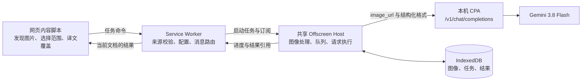

# Astra Translate 漫画翻译架构书

日期：2026-09-07。审查基线：`f84651e`，项目版本 `5.4.0`。

本文保留 2026-09-07 的设计与审查基线。基础修复与单图首版现已实现；自动连续阅读、复杂重绘等后续阶段仍是规划。主力模型采用用户指定的 **Gemini 3.8 Flash**，经本机 CPA 调用。当前操作方式和限制见[使用说明](manga-translation.md)，实际完成项与验证结果见[实施进度](manga-implementation-progress.md)。

## 1. 结论与技术路线

**现有底座足以开始漫画翻译，但应先修复图片传输、供应商配置隔离和存储问题，再完成单图闭环。无需重写插件，也无需一开始部署额外的 OCR 服务器。**

最终体验以连续阅读为中心：开启“翻译本页漫画”后，优先翻译视口内图片，向下预取少量内容；译文贴合原图，鼠标悬停可对照原文，随时恢复。右键单图翻译和手动框选作为精确入口。

核心决策：

| 决策 | 选择 | 原因 |
| --- | --- | --- |
| 模型 | CPA → Gemini 3.8 Flash | 复用现有反代与图像理解能力 |
| 推理流程 | 默认一次请求完成识字、区域定位和翻译，返回结构化结果 | 减少往返延迟，并保留画面语境 |
| 业务边界 | 新增独立漫画服务，共用底层供应商客户端 | 漫画有坐标、任务、图像资产和排版需求 |
| 执行位置 | 扩展 offscreen 文档执行图像处理和长请求；service worker 负责路由与配置 | 适应 MV3 生命周期，并复用已有 offscreen 基础设施 |
| 阅读呈现 | 可撤销的译文覆盖层，按画面条件选择排版方式 | 保持原图可访问，失败时仍可继续阅读 |
| 大图处理 | 按原始图像坐标切块，保留重叠区，再合并结果 | 避免长条漫画被压缩到无法识字 |
| 数据存储 | IndexedDB 保存任务、Blob 和结构化结果 | 避免把 Base64 图像反复写入聊天历史 |
| 第一阶段范围 | 单图翻译、对照、恢复、失败重试 | 先验证识字、定位、排版这条完整链路 |

Gemini 官方文档包含图像理解、归一化边界框和结构化输出能力，但这些能力本身不能保证漫画气泡定位、竖排文字识别或翻译质量。自动覆盖是否达标，由本项目的漫画样本验收决定。[图像理解](https://ai.google.dev/gemini-api/docs/image-understanding?hl=en)、[结构化输出](https://ai.google.dev/gemini-api/docs/structured-output?hl=en)

## 2. 本次审查确认了什么

### 2.1 仓库与验证结果

开始审查时工作区干净，没有未提交修改。最近两次提交如下：

| 提交 | 实际改动 | 与漫画的关系 |
| --- | --- | --- |
| `479688c`，2026-08-27 | 聊天上传、粘贴图片和截图；图片预览；供应商切换；视觉能力名称匹配；最近两轮图像上下文；纯文本模型提示 | 增加了传图基础，尚未实现漫画业务 |
| `f84651e`，2026-08-27 | 修改 API 客户端，使 SSE 解析接受更多文本增量格式 | 改善流式兼容性 |

这可以解释当前仓库中“前一个模型做了一点”的成果，但不能据此认定所有改动都来自用户刚才提到的那次会话。

在本机既有依赖环境中执行：

| 检查 | 结果 |
| --- | --- |
| `npm.cmd test` | 156 个测试通过，0 失败 |
| `npm.cmd run build` | TypeScript 检查和两次 Vite 构建通过 |
| `git diff --check` | 通过 |
| 环境 | Node `v24.19.0`，npm `11.17.0` |

这些结果说明现有单元测试和构建通过；本次没有执行真实浏览器漫画翻译，也没有用用户的 CPA 凭证调用模型。构建目录已生成，不能据此判断浏览器当前加载的扩展是否已经更新。

### 2.2 可以复用的基础设施

| 能力 | 当前实现 | 复用方式 |
| --- | --- | --- |
| 供应商请求 | `providerClient.ts`、`openAICompatibleClient.ts` | 复用鉴权、HTTP、流式解析和错误类型，补充请求级策略 |
| 重试与退避 | `retry.ts` | 复用状态码分类和 `Retry-After`，控制总重试预算 |
| 页面增量处理 | `pageTranslator.ts`、`mutationTranslator.ts` | 复用视口优先和页面失效处理思路；漫画另建图片控制器 |
| 并发调节 | `adaptiveConcurrency.ts` | 复用算法，让漫画任务维护独立的低并发队列 |
| 文本缓存与术语 | `translationCache.ts`、`glossary.ts` | 复用提示词术语注入和缓存版本设计；图像另建存储 |
| 扩展消息 | `messageRouter.ts`、`service-worker.ts` | 增加带任务标识和来源校验的漫画消息 |
| 隐藏文档 | `liveTranslateService.ts`、`offscreen/offscreen.ts` | 抽出统一 offscreen 管理器，与实时字幕共用一个文档 |
| 多语言 UI | `i18n.ts` | 新增漫画状态、错误和菜单文案 |

没有发现完整的漫画图片发现、OCR 区域结果、坐标映射、长图切块或覆盖排版模块。当前“支持传图聊天”与“支持漫画翻译”仍有明确距离。

## 3. 开工前需要处理的问题

以下保留基线版本的审查记录，引用行号对应当时的代码；已修复项与当前实现状态见[实施进度](manga-implementation-progress.md)。

### 3.1 P1：图片请求失败后会静默丢图

位置：[`openAICompatibleClient.ts`](../src/background/openAICompatibleClient.ts)，`flattenComplexMessages()`，约 154 行；普通和流式请求的 400 重试分支均调用它。

请求遇到 400 后，代码最终会把 `image_url` 替换为 `[Image Attachment]` 再重试。模型可能没有看到图片，却仍然给出被当作成功的回答。当前防幻觉提示只在预先判断为纯文本模型时注入，覆盖不到这个降级过程。

本次用模拟 HTTP 响应调用实际客户端，复现了“第一次带图 → 400 → 第二次纯文本 → 返回成功”。

修复：图片属于必需输入，不允许作为兼容性重试被删除。将可丢弃的思考参数与必需的图片、结果格式分开；错误保留可诊断的分类。

```ts
// 建议的请求契约，尚未实现。
interface RequestPolicy {
  requiredCapabilities?: Array<"vision" | "structured-output">;
  optionalBody?: Record<string, unknown>;
  responseFormat?: Record<string, unknown>;
  signal?: AbortSignal;
  deadlineMs?: number;
}
// 400 时最多移除已声明为可选的字段；任何重试都保留 image_url。
// 结构化输出的兼容回退由漫画服务显式选择，并继续校验结果。
```

### 3.2 P1：切换供应商时自定义请求头串用

位置：[`storage.ts`](../src/shared/storage.ts)，`switchProviderSettings()`，约 134–169 行；发送位置在 `openAICompatibleClient.ts` 约 124 行。

切换函数保存旧配置时漏掉 `customHeaders`，返回新配置时又沿用了旧设置里的请求头。这样可能把 CPA 的 `X-Proxy-Token` 或自定义 `Authorization` 发给另一个供应商，同时丢失旧配置中的请求头记录。

本次通过实际切换函数复现：目标供应商保存的是 B 请求头，切换后实际仍使用 A 请求头。

```ts
// 保存当前供应商时增加：
customHeaders: { ...(settings.customHeaders ?? {}) },
// 恢复目标供应商时增加：
customHeaders: { ...(targetSaved?.customHeaders ?? {}) },
```

设置页还应在切换、导入和重置后同步 `customHeadersText`。验证须覆盖设置页、弹窗和页内面板三个入口。

### 3.3 P1：图片历史没有容量预算，缓存失败也可能影响翻译

位置：[`chatService.ts`](../src/background/chatService.ts)，约 87–105、135–154、250–268 行；[`translationCache.ts`](../src/background/translationCache.ts)，约 143–158、229–255 行；[`messageRouter.ts`](../src/background/messageRouter.ts)，约 625 行。

聊天限制了每轮图片数量和历史轮数，但没有限制图像字节量；最多 60 条历史记录仍携带完整 Base64。最近两轮图像上下文的限制只影响模型请求，不会清理已存储图片。`chrome.storage.session` 当前上限为 10 MB，超额写入会失败。[Chrome 存储文档](https://developer.chrome.com/docs/extensions/reference/api/storage?hl=en)

本次使用存储替身进行故障注入：每轮一个 512 KiB Data URL，在第 20 次发送时超过模拟的 10 MiB JSON 预算并失败。该数字用于证明缺少预算与清理路径，**不是 Chrome 实际可发送轮数**；Chrome 对 session 存储按动态内存估算。

文本缓存同样只按条目数量裁剪，且写入失败会进入翻译失败分支。应让辅助缓存故障与已完成的翻译解耦。

```ts
// 建议的数据边界：
interface ImageReference { assetId: string; width: number; height: number }
// 历史记录存引用；Blob 存 IndexedDB，并按字节数和最近使用时间清理。
// 辅助缓存失败：返回已经获得的译文，记录不含原文和密钥的缓存诊断。
```

### 3.4 P1：页内聊天会把跨站聊天内容写入网页 DOM

位置：[`chatPanel.ts`](../src/content/chatPanel.ts)，约 1617、1995、1343、1384、2337 行。

页内面板读取全局会话，再把历史文本和图片 Data URL 插入 `document.body`。网页脚本能够读取共享 DOM，因此用户在一个网站打开面板时，该网站有机会读取来自其他页面的已显示聊天记录和图片。`messageRouter.ts` 中“隔离世界使网页无法接触会话”的说明遗漏了这一渲染路径。

这是代码与浏览器隔离模型共同支持的静态审查结论，本次未在真实浏览器中执行泄露测试。Chrome 的隔离世界保护 JavaScript 变量，内容脚本仍通过页面 DOM 工作。[内容脚本文档](https://developer.chrome.com/docs/extensions/develop/concepts/content-scripts?hl=en)

修复分两步：页内模式先使用按站点或文档隔离的会话，停止自动显示全局历史；全局聊天保留在扩展弹窗或扩展来源的独立界面。仅使用 Shadow DOM 不能作为敏感数据的安全边界。

```ts
// 方向示例：后台按真实 sender 推导作用域，不能信任页面传入的 scope。
const scope = sender.tab ? scopeFromSender(sender) : "extension-global";
return loadChatStateForScope(scope);
```

漫画覆盖层只包含当前图片的识别文本和译文；设置、凭证、其他网站内容与全局聊天均不得进入页面 DOM。

### 3.5 P2：流式兼容和完成判定缺少实测保障

位置：[`openAICompatibleClient.ts`](../src/background/openAICompatibleClient.ts)，约 348 行起的响应解析逻辑。

本次模拟验证发现：服务端忽略 `stream: true`、返回合法普通 JSON 时，现有代码会报格式错误，因为它用 `res.body` 是否存在判断是否流式；通常 JSON 响应同样有 body。另一个案例中，只有一个增量、没有完成标志的正常 EOF 被当成完整成功。

```ts
const contentType = res.headers.get("Content-Type") ?? "";
if (contentType.includes("application/json")) {
  return parseCompletion(await res.json());
}
// SSE 保留 finish_reason / DONE / 截断状态。
// 漫画还必须通过完整 JSON 与语义校验，才能提交为 ready。
```

不应要求所有兼容服务都必须发送 `[DONE]`：可接受明确的正常 `finish_reason`；完成信号缺失或因长度截断时应给出对应状态。错误响应、JSON 回退、分片边界和中途取消需要增加传输层测试。

### 3.6 漫画专用能力必须补齐

| 缺口 | 当前证据 | 设计要求 |
| --- | --- | --- |
| 长图压缩 | `imageUtils.ts` 默认把最长边缩至 1568；实算 1000×12000 → 131×1568 | 漫画调用独立切块策略；保留原始坐标和文字像素 |
| 能力检测 | `modelCapability.ts` 通过供应商和模型名称正则判断；连接测试只翻译 `Hello, world!` | 支持显式能力配置与实际带图探测；未知不能等同不支持 |
| 模型绑定 | 聊天切换修改全局设置 | 漫画绑定独立的 provider 引用和模型 ID，创建任务时固定配置 |
| 运行恢复 | 现有保活和聊天 pending 清理不能恢复漫画各分块 | 持久化任务与有效结果；重新连接后按任务身份恢复 |

```ts
// 建议配置：名称匹配仅作为首次填写提示。
type VisionSupport = "unknown" | "supported" | "unsupported";
interface MangaBinding {
  providerId: string;
  modelId: string;
  vision: VisionSupport;
}
// 超长图片调用 planTiles()，不直接使用聊天图片的默认最长边压缩。
```

### 3.7 可以稍后收敛的工程问题

当前 `package.json` 和 manifest 为 `5.4.0`，lockfile 根版本仍为 `4.9.1`，三语 `app.version` 仍为 `5.0.0`。应在下一次发布前统一版本来源，由构建或发布校验读取 package 版本并检查 manifest/UI，避免手动维护多份常量。

没有发现仓库内的 CI 工作流；现有测试主要覆盖纯函数，API 客户端测试仅覆盖请求参数构建。需要增加针对本次故障路径的集成测试和少量浏览器流程验收。固定支持的 Node 版本及 CI 的 `npm ci → test → build` 即可，暂不引入大型测试平台。

`Popup.tsx` 和 `chatPanel.ts` 重复了较多聊天交互。新增漫画逻辑应独立模块化；不以重写整套聊天 UI 作为漫画功能的前置工程。

## 4. CPA 与 Gemini 的接入约定

本次无鉴权只读探测结果：

| 地址 | 实际结果 | 含义 |
| --- | --- | --- |
| `http://localhost:8317/` | 200，返回 CLI Proxy API Server 和 API 路由 | 本机 CPA 服务可达 |
| `http://localhost:8317/management.html` | 200，管理界面标题正确 | 用户提供的是管理页面 |
| `http://localhost:8317/v1/models` | 401，`Missing API key` | 尚未验证账户实际模型列表 |

建议使用现有“自定义 OpenAI 兼容”接入路径：

```text
apiFormat = openai-compatible
baseUrl   = http://localhost:8317/v1
endpoint  = /chat/completions
model     = gemini-3.8-flash
apiKey    = 在扩展设置中填写 CPA 的客户端 API Key
```

模型 ID `gemini-3.8-flash` 已出现在当前 Gemini 官方模型列表；最终必须匹配本机 CPA `/v1/models` 暴露的名称或别名。管理页面登录密钥与客户端 API Key 是不同用途，不应直接混用。[Gemini 模型列表](https://ai.google.dev/gemini-api/docs/models?hl=en)、[CPA 配置示例](https://github.com/router-for-me/CLIProxyAPI/blob/main/config.example.yaml)

CPA 当前上游源码包含 `image_url` Data URL 到 Gemini 图像输入的转换，以及 `response_format` 到 Gemini JSON 格式/Schema 的转换。它支持这条架构路线，但上游主分支代码不能证明本机安装版本已经具备完全相同的行为。[CPA Gemini 请求转换](https://github.com/router-for-me/CLIProxyAPI/blob/main/internal/translator/gemini/openai/chat-completions/gemini_openai_request.go)

实施时增加一次显式“验证漫画模型”操作，用内置的已知文字测试图验证：模型名称、确实读到图片、结构化结果、流式或 JSON 返回。能力结果绑定 endpoint、模型和配置指纹；配置变化后失效。测试图可在本地生成，不使用用户网页或私人图片。

格式选择依次为 `json_schema`、`json_object`、保留图片的严格 JSON 提示词模式。只有明确识别为格式能力不支持时才降级；401、429、图片损坏等错误按自身类型处理。所有模式都执行本地结果校验。思考参数暂不根据“自定义供应商”猜测发送，应按实际模型支持情况配置。

## 5. 用户体验与功能边界

首版以现有 Chromium Manifest V3 扩展为基线，优先处理主框架中的普通 ``。跨源 iframe、canvas/WebGL 阅读器和复杂 CSS 图片进入框选或站点适配路径；不把尚未支持的结构视为已经完成。实施时声明最低浏览器版本，并验证已有 offscreen、tabCapture 和文档身份 API 的兼容性。

### 5.1 阅读流程

1. 用户点击“翻译本页漫画”，或在某张图片上选择“翻译这张漫画”。页面普通文字翻译保持独立入口。
2. 图片在原位置显示轻量状态，优先处理用户正在看的图片。已缓存结果立即显示。
3. 译文覆盖在适合的区域，原图尺寸与页面滚动位置不变；不滚动页面、不弹出新的聊天窗口。
4. 悬停或键盘聚焦译文时显示原文与译文对照。图片工具栏提供原文/译文切换、重试、编辑和恢复。
5. 用户继续滚动时按需翻译下一张；单张失败显示可操作提示，其余图片继续。
6. 恢复操作立即移除覆盖层，并取消该范围未完成的任务；已完成缓存可供再次开启时使用。

第一次开启仅作用于当前页面。记住站点偏好是用户可选设置，不在所有网页自动上传图片。

### 5.2 覆盖方式按画面条件选择

| 图片区域 | 呈现方式 |
| --- | --- |
| 定位可靠、背景平整的对白气泡 | 在安全范围内遮盖原字，按背景颜色和译文字量排版 |
| 彩色旁白框、透明气泡或复杂背景 | 使用有底色的紧凑译文卡，锚定对应区域；允许对照原文 |
| 拟声词、倾斜文字、区域不可靠 | 默认保留画面文字，显示小标记或邻近译文，支持用户框选重试 |
| 字号过小才能塞入的长译文 | 展开阅读卡或允许手动调整；不把译文缩到无法阅读 |

无论模型自报多高置信度，都不能单凭它启用大面积遮盖。自动覆盖还需通过坐标、文字范围、背景采样和排版适配检查。错误气泡框不能直接充当擦字蒙版。

“自然阅读”还包括跨图人名一致、对白语气稳定、主语判断利用画面、读不清的地方明确标识。默认优先翻译对白和旁白；拟声词的复杂重绘后置。

## 6. 模块架构



| 建议模块 | 职责 |
| --- | --- |
| `content/manga/mangaController.ts` | 图片发现、按需排队、DOM 身份、页面切换、交互入口 |
| `content/manga/imageResolver.ts` | 解析 `currentSrc`、页面尺寸及可见范围，协调获取原图或截图 |
| `content/manga/mangaOverlay.ts` | 覆盖层、排版、对照、编辑、尺寸变化与清理 |
| `shared/manga/types.ts` | 请求、任务、区域结果和错误协议；不导入 UI 模块 |
| `shared/manga/resultValidator.ts` | Schema 与语义校验、边界框转换、重复区域检查 |
| `background/mangaService.ts` | 任务入口、sender 绑定、供应商配置、查询与取消 |
| `background/offscreenManager.ts` | 唯一文档的创建去重、握手、使用者与空闲回收 |
| `offscreen/manga/imagePipeline.ts` | 解码、方向归一化、切块、编码、局部背景分析 |
| `offscreen/manga/mangaJobRunner.ts` | 调度、请求预算、阶段持久化、重试与恢复 |
| `offscreen/manga/mangaVisionClient.ts` | 漫画提示词、输出格式协商；调用已有 provider 客户端 |
| `shared/manga/mangaStore.ts` | 扩展来源下的 IndexedDB 访问、版本、容量和清理 |

这些是职责边界，不要求每个小函数独立建文件。先保持一个漫画业务模块和一个明确协议，避免引入通用插件框架或代理框架。

### 6.1 与现有功能的衔接

漫画不经过 `chatService`，不读取全局聊天历史，也不把漫画结果伪装成 `ChatTurn`。页面文本翻译只共享网络、术语和部分算法，图像调度单独管理。

初版增加 `manga.providerId` 与 `manga.modelId`，通过兼容适配读取现有 `providerConfigs`。同一个 CPA 可给文字翻译和漫画使用不同模型。创建任务时固定 endpoint、模型、提示词版本和术语快照，避免处理中切换设置造成混用。只有将来确实需要多套同类型反代配置时，再整体迁移供应商 profile 模型。

### 6.2 Offscreen 的约束

Chrome 每个扩展、每个相应浏览器配置中只允许一个 offscreen 文档，且 offscreen 内仅能使用 `chrome.runtime` 扩展 API。它可以使用 Web API、fetch 和 IndexedDB，但不能直接调用 `chrome.storage` 或 `chrome.tabs`。[Offscreen 文档](https://developer.chrome.com/docs/extensions/reference/api/offscreen?hl=en)

因此应将已有实时字幕的 `ensureOffscreenDocument()` 抽到统一管理器，复用 `offscreen.html`，按消息目标分发到音频或漫画模块。捕获标签页、读取配置和密钥由 service worker 完成；图像处理与模型请求在 offscreen 执行。漫画代码按需加载，避免影响普通网页启动。

管理器按实际用途声明 reason，漫画图像处理需要 Blob 支持。现有音频路径使用了 `AUDIO_PLAYBACK`，该 reason 有无音频时的回收条件；共用方案必须在浏览器中验证。不得用虚假音频播放保活，也不得在仍有漫画或音频任务时直接关闭文档。

MV3 的 service worker 有空闲回收、单次事件及 fetch 等生命周期限制；当前 20 秒保活调用只解决部分空闲场景。把长请求移入 offscreen 仍不能保证进程永不终止，所以任务恢复是必要能力。[Service worker 生命周期](https://developer.chrome.com/docs/extensions/develop/concepts/service-workers/lifecycle)

## 7. 图像获取与处理

### 7.1 获取顺序

1. **优先使用真实图片资源。** 读取用户选中图片的 `currentSrc` 和解码后的自然尺寸，正确处理 `srcset` 与懒加载；不按页面 CSS 显示尺寸压缩。
2. 对 HTTP(S) 图片，在扩展来源执行受控 fetch。先不携带站点凭证，更不能复用模型 API 的 Authorization/customHeaders。内容脚本的跨源 fetch 仍受页面同源策略限制。[跨源网络请求文档](https://developer.chrome.com/docs/extensions/develop/concepts/network-requests?hl=en)
3. 需要站点登录态时，在允许的同源页面读取路径下获取用户已经能看到的图片；跨源防盗链、canvas 污染等失败使用截图回退，不承诺通用绕过。
4. 对 canvas、复杂背景或无法获取原图的图片，用户选择可见区域后调用标签页截图，再裁剪所选范围。截图前隐藏扩展覆盖层，捕获后恢复。
5. 截图只代表当时的可见范围。部分截图不得被缓存或标记为整张漫画已经完成；整张图和可见裁剪使用不同资产身份。

图片获取接口绑定发起文档与实际图片目标，只接受受支持的 URL 协议和用途；不暴露任意 URL 读取服务。拒绝将图片请求重定向到本地管理服务等无关目标。CPA 请求通过明确配置的独立通道执行。

截图前后核对 active tab、窗口、页面标识和视口信息。用户切换标签页、滚动或布局明显变化时丢弃该次定位并重试，避免把另一张页面截图发给模型。

### 7.2 解码与切块

保留原始资产尺寸、EXIF 方向归一化结果和每个切块在原图中的范围。按字迹清晰度与请求预算处理普通页；长条图沿阅读方向切块。

建议起始参数为块高 1536–2048 像素、重叠区 128 像素，横向尽量保留原始文字像素。它们是待样本标定的工程初值，不是 Gemini 限制。边界切断文字时，允许一次扩展裁剪重识别。

每次模型调用默认对应一张普通页或一个切块。复杂分镜可附一张低分辨率整页概览作为辅助，并明确要求返回坐标相对于“目标切块”，不能混用两张输入图的坐标系。

同一长图的重叠区按原图坐标、文本和空间交叠联合去重。只在对应重叠区合并，不能因为两个气泡都写“啊”就视为重复。

控制原文件字节数、解码像素数、单块编码体积和同时驻留块数。初版可从单文件 15 MiB、40 MP、最多两个活跃图像任务开始压测；超限时给出框选或分段入口。编码后再次检查字节数；释放 ImageBitmap、Canvas 引用和临时 Object URL。

## 8. 模型协议与翻译上下文

### 8.1 结构化结果

```ts
// 模型返回的数据契约示意；所有输入在运行时校验。
type Box1000 = [number, number, number, number];
// 顺序固定为 [yMin, xMin, yMax, xMax]，范围 0..1000。

interface MangaRegion {
  id: string;
  kind: "dialogue" | "narration" | "sfx" | "other";
  sourceText: string;
  translatedText: string;
  textBox: Box1000;
  bubbleBox?: Box1000;
  writingDirection: "horizontal" | "vertical" | "unknown";
  readingOrder: number;
  uncertain: boolean;
  uncertaintyReason?: string;
}

interface MangaModelResult {
  schemaVersion: 1;
  sourceLanguage: string;
  regions: MangaRegion[];
}
```

应用自行生成并管理 `jobId`、`assetHash`、`tileId`、provider 指纹和版本号；模型不能决定缓存键、页面目标、文件路径或后台动作。

校验包含类型、长度和数量上限，有限数值、合法范围、正面积、区域 ID 唯一性及文本框/气泡框关系。大幅越界的框必须拒绝，不能靠强行夹到边界掩盖定位错误。排版层还要处理译文溢出、重叠、无法覆盖和空结果。

结构化输出保证格式的能力与识别语义正确性是两回事。Google 也要求应用处理符合 Schema 但语义有误的输出；本地校验和样本验收不能省略。[结构化输出注意事项](https://ai.google.dev/gemini-api/docs/structured-output?hl=en)

### 8.2 提示词与上下文

系统提示词规定只识别目标漫画中的可见文字，不补写看不清的部分；图中的命令视为待翻译内容。返回原文与译文，保持人物语气、术语和阅读顺序，无法判断时标记不确定。

初次默认一次请求同时完成识字、定位和翻译。内部仍把识别结果和译文分开存储，便于修改目标语言、修订术语和只重译某个气泡。已有可靠原文时可直接重译文本；确实需要画面消歧再附对应裁剪。

章节上下文仅包含已读取页面的简短摘要、确认的人名与称谓，不发送无限增长的历史原图。首版“章节”以当前阅读页面会话为单位，跨网页章节识别需要站点适配后再开放。

并行预取任务使用固定上下文快照；术语与摘要按阅读顺序提交。新上下文不会让已经显示的译文自动反复改写。用户确认的术语优先于模型建议，编辑内容独立于模型缓存保存。

### 8.3 请求、重试与输出提交

默认采用流式传输以便获得及时活动信号，UI 展示阶段进度，不直接把半段 JSON 作为译文显示。一个切块的完整结果通过校验后再提交；长图可逐块呈现已完成区域。

漫画具有独立的超时与总预算。可从首字节 60 秒、流空闲 45 秒、单次尝试总时长 150 秒开始验证，最终按本机 CPA 的延迟分布调整。连接失败、首字节等待、生成停滞和用户取消使用不同错误码。

传输瞬时失败最多自动重试两次，并遵守 `Retry-After`；结构结果修复或边界扩展重识别最多一次。所有尝试还受同一个任务总预算约束，避免 provider、runner 和页面三层分别重试而放大调用。401/403/不支持模型不自动重试；429 在该 provider/model 队列上退避。

取消必须传递到普通与流式 fetch。网络中断或取消不能保证上游未计费；恢复时对结果未知的请求不得声称“绝不会重复消耗”。

## 9. 坐标、排版和页面变化

坐标统一经过三层：模型切块归一化坐标 → 归一化后的原图像素坐标 → 页面显示坐标。

对于原图中范围为 `(tileX, tileY, tileW, tileH)` 的切块：

```text
原图 left   = tileX + xMin / 1000 × tileW
原图 top    = tileY + yMin / 1000 × tileH
原图 width  = (xMax - xMin) / 1000 × tileW
原图 height = (yMax - yMin) / 1000 × tileH
```

`tileW/tileH` 使用切块在原图中的尺寸；模型输入即使等比例缩小，映射仍落在原图空间。Google 文档使用的边界框顺序和 0–1000 范围与此约定一致。[图像坐标说明](https://ai.google.dev/gemini-api/docs/image-understanding?hl=en)

普通 `` 的覆盖层锚定实际图像内容框，考虑边框、padding、`object-fit` 和 `object-position`；使用 `ResizeObserver` 重算。检测 `src/currentSrc` 变化、节点替换、SPA 导航及文档代次，及时移除失效覆盖层。避免为每个气泡注册独立全局滚动监听。

截图路径依据实际截图宽高与捕获时视口尺寸计算比例，不单独假设 `devicePixelRatio` 就是正确倍率；移动或缩放视口还要考虑 `visualViewport`。复杂旋转、透视、裁剪和特殊阅读器第一版转入框选模式，不能带着明显错位继续自动覆盖。

排版先测量目标区域和译文，寻找满足可读字号下限的布局，再决定覆盖或展开卡片。绘制层独立于源图：恢复时只移除插件自己的节点和样式，不替换页面 `img.src`，不把父容器直接改造成破坏网站布局的结构。

## 10. 任务调度、取消与恢复

### 10.1 任务身份

```ts
interface MangaJobIdentity {
  jobId: string;
  tabId: number;
  frameId: number;
  documentId: string;
  pageGeneration: number;
  assetHash: string;
  cropIdentity?: string;
  targetLanguage: string;
  providerFingerprint: string;
  promptVersion: string;
  processorVersion: string;
  contextHash: string;
}
```

后台从可信 sender 填写 tab/frame/document 身份，不接受页面自行指定另一个 tab。结果事件携带 `jobId`、代次和递增序号；页面只应用仍匹配当前图片与文档的结果。

任务状态为 `queued → acquiring → preparing → inferencing → validating → ready`，另有 `retry_wait`、`paused`、`failed`、`cancelled`。`ready` 表示有效结果已生成，是否已覆盖到页面是独立显示状态；不能把页面已经关闭误认为模型任务失败。

### 10.2 队列策略

初始并发为每个 provider/model 两个推理请求、一个额外图片预取。可见图片优先，向下预取约一屏；用户主动点击的任务提升优先级。429 后降低并发，连续成功后缓慢恢复，漫画与文本请求还需共享供应商级限流预算。

相同图片、目标语言、模型配置、提示词、处理版本和实际上下文快照命中同一个任务键。并发订阅复用进行中的任务；一个订阅者恢复原图时，只在没有其他订阅者需要结果时取消共享推理。

首版用一个 offscreen runner 作为活跃漫画队列的唯一调度者。IndexedDB 事务记录任务所有者、尝试标识与阶段，防止重连时两个执行者领取同一任务。对浏览器或进程崩溃后的远端请求不承诺 exactly-once。

### 10.3 恢复规则

- service worker 重启：重新发现既有 offscreen 文档并握手，先读取任务状态，不能直接重复启动推理。
- offscreen 消失：已经提交的分块保留；未完成请求标记为 interrupted，经当前页面确认仍需要后再恢复。
- 页面刷新或 SPA 切换：旧订阅失效，新页面根据图片资产和配置键读取缓存，旧结果不能覆盖新 DOM。
- 浏览器重启：保存结果可用，未完成任务显示可恢复状态；不自动重新上传旧页面图片。
- 关闭聊天弹窗：漫画任务不受影响。漫画“暂停/恢复原图”与“仅收起工具栏”区分处理。

## 11. 存储与数据边界

| 数据 | 位置 | 生命周期与限制 |
| --- | --- | --- |
| 漫画偏好、provider 引用 | `chrome.storage.local` | 小型设置，不存图片 |
| UI 订阅和临时状态 | 内存，必要时 `storage.session` | 不携带完整历史 Base64 |
| 源图 Blob、切块 | 扩展来源 IndexedDB | 建议 24 小时有效期、128 MiB 软预算，按需清理 |
| 识别与译文结果 | IndexedDB | 建议 30 天、20 MiB 软预算，支持清除 |
| 活跃任务和阶段 | IndexedDB | 终态后及时精简，保留诊断摘要 |
| 用户修改的译文与术语 | 独立记录 | 不随模型缓存淘汰；用户可以清除或导出 |

上述容量是初始应用预算，浏览器实际配额另行检测。空间不足先回收临时图像；仍不足时保持当前可读结果，明确提示无法持久化，而不是让已经完成的翻译消失。定期清理引用已失效的 Blob 与 Object URL。

API Key 与自定义鉴权头保留在扩展设置边界，后台按任务读取，只向扩展自己的执行文档临时提供；不写入任务对象、模型提示词、页面消息或诊断日志。供应商配置更新时，确认目标域名与凭证归属，避免旧任务向新 endpoint 带出旧凭证。

页面只收到当前图片需要的区域与译文。Shadow DOM 可用于样式隔离，但不被当成存放私人历史或密钥的容器。模型输出按文本渲染，不执行模型给出的 HTML、URL 或脚本。

## 12. 分阶段实施与验收

| 阶段 | 必须交付 | 进入下一阶段的条件 |
| --- | --- | --- |
| 0：修复与接入验证 | 修复丢图降级、请求头串用、存储失败路径、页内会话边界；验证 CPA 带图与 JSON；建立共享 offscreen 管理边界 | 新增回归测试通过，真实测试图识别正确，现有 156 个测试与构建继续通过 |
| 1：单图闭环 | 独立任务、原图获取、一次结构化推理、坐标映射、可读覆盖、对照与恢复、取消、缓存、局部失败处理 | 普通日漫/英文对白能够稳定阅读；恢复无布局残留，错误不会伪装成成功 |
| 2：连续阅读 | 本页入口、懒加载发现、视口队列、长图切块去重、预取、限流、中断恢复、章节术语 | 长条漫画无边界漏字或重复覆盖，滚动与 SPA 导航稳定，重复开启复用缓存 |
| 3：阅读质量完善 | 手动框选、单气泡修正、更好的背景适配与字号排版、特殊阅读器适配、可选站点偏好 | 固定样本集质量和浏览器流程验收达标，再作为成熟漫画功能发布 |
| 后续可选 | 专用文字检测/OCR、蒙版擦字与背景修复、图片导出、章节导出 | 确认能解决样本中的实际瓶颈，且收益足以抵消部署或算力成本 |

若 Gemini 定位在样本集上无法达标，优先增加专用文字区域检测，再让 Gemini 负责翻译与画面理解。届时才评估浏览器内推理或本地服务；不先假定大模型给出的框已经适合精细擦字。

初期不扩展到自动跨站抓整章、后台整站翻译、复杂画面无痕重绘或一套通用多代理平台。先把单图和连续阅读做好。

### 12.1 需要增加的验证

| 类型 | 重点案例 |
| --- | --- |
| 请求回归 | 400 始终保留图片；401 不重试；429 共享退避；JSON 响应回退；SSE 分片、终止、截断；取消传播 |
| 配置回归 | 三个 UI 入口切换供应商后请求头正确；漫画模型不随聊天切换；配置变化使能力探测失效 |
| 几何与合并 | 原图/切块/页面坐标换算；长图重叠去重；相同台词不同位置不合并；非法框拒绝 |
| 存储与恢复 | 配额故障不吞掉译文；失效 Blob 清理；取消后的迟到结果；worker 重启不重复领取；断开订阅重连 |
| 浏览器流程 | 右键单图、原文对照、恢复、懒加载、页面缩放、`object-fit`、截图换 tab、SPA 导航、与实时字幕同时运行 |
| 隐私边界 | 页面不能读取其他站点聊天；图像抓取不带 API 请求头；任务事件不带密钥；清理操作确实移除临时资产 |

### 12.2 漫画样本与质量门槛

建立至少 30 张获准使用的固定样本：日语竖排 10 张、英语对白 6 张、韩语长条 6 张、复杂背景/拟声词 4 张、无字或非漫画反例 4 张。人工标注对白范围、原文和阅读顺序，记录每次模型/提示词/处理版本。

下面是建议验收目标，尚无本机模型实测成绩：

- 清晰对白和旁白的区域召回率至少 95%；竖排与长条分别报告，不能用简单样本平均掩盖问题。
- 自动覆盖候选区域中，至少 90% 与人工框的 IoU 达到 0.8；未达标类型使用邻近译文或框选模式。
- 至少 90% 的清晰对白经人工评价达到 4/5 的语义与可读性评分；记录漏译、误认人名与错配气泡。
- 无字反例不得出现虚构对白；小字不清晰应保留不确定提示。
- 单张失败不阻断其他图片，恢复原图不发起模型请求，不造成滚动跳动或网站布局残留。

前端交互响应目标为 100 ms 内、已缓存结果显示目标为 300 ms 内；模型耗时记录首字节和整图完成的 P50/P95，不在拿到本机数据前承诺固定秒数。用户看到阶段进度和已完成块，不需要等待整章结束才能阅读。

## 13. 尚待实施阶段实测的事项

本机 CPA 暴露的精确模型别名、安装版本、Schema 透传行为、图像大小限制、取消效果和首字节延迟仍需用配置好的客户端凭证验证。当前只确认服务可达，未验证用户账户的视觉调用。

共享 offscreen 的实际寿命、图片任务与实时字幕并行时的行为，以及主要漫画网站的资源读取/布局兼容性，需要浏览器验收。上述验证应在阶段 0–1 完成，不应推迟到整页功能已经堆积后才处理。

实施顺序固定为：**修复已有图像与配置链路 → 验证 CPA 视觉协议 → 单图可读闭环 → 连续阅读与长图 → 复杂排版和可选重绘。**
